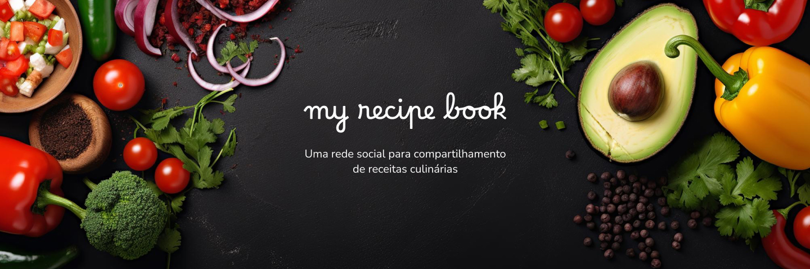

<p align="center">
    
    
    
</p>

**My Recipe Book** é uma rede social para amantes da culinária. Os usuários podem:

- 📚 **Cadastrar receitas** com ingredientes e instruções detalhadas;
- 💬 **Curtir e comentar** receitas de outros usuários;
- ⭐ **Explorar as receitas mais populares**, com base em curtidas e comentários.

Esta aplicação foi projetada para estudar e aplicar conceitos e artefatos de **Angular 19** de forma prática e incremental, utilizando os mais recentes features, como:

- Input, output e model usando signals;
- Injeção de dependência inject-based;
- Control flow com @if e @for;
- TypeScript 5.6;
- Tudo standalone!

## 🚀 Configuração do projeto

### Pré-requisitos

Certifique-se de ter instalado:

- [Node.js](https://nodejs.org/) (versão 20+)
- [Angular CLI](https://angular.dev) (versão 19)

### Passo a passo

1. Clone este repositório:

```bash
https://github.com/ortegavan/recipes.git

# Após clonar, entre na pasta da aplicação com o comando:
cd recipes
```

2. Instale as dependências:

```bash
npm install
```

3. Sirva a aplicação:

```bash
ng serve
# A aplicação estará disponível na URL http://localhost:4200/
```

## 📌 Informações adicionais

### Backend

A aplicação utiliza uma API fake que está configurada na https://mockapi.io e disponível no link abaixo:

```bash
https://66f863922a683ce9730f60fc.mockapi.io/api/
```

Os endpoints estão configurados todos como somente leitura. Se você quiser interagir melhor com a aplicação, utilize, em vez da MockAPI, a imagem do Docker disponível em:

```bash
docker pull ortegavan/recipes-api
```

Não se esqueça de alterar o endereço da API nos arquivos `environment`.

### Frontend

A aplicação foi criada usando Angular CLI 19.0.6.

A aplicação utiliza o **PrimeNG 19** como biblioteca de componentes e o tema **Lara** está configurado como preset. Para saber mais sobre o PrimeNG, visite https://primeng.org.

A fonte **Nunito** é a fonte padrão utilizada por toda a aplicação. A fonte **Borel** é utilizada no logo. Ambas fazem parte de [Google Fonts](https://fonts.google.com).

Há um protótipo do projeto disponível no Figma em https://bit.ly/figma-angular-na-pratica.

A **responsividade não foi aplicada** no projeto porque não é um assunto trivial e merece foco especial. Não queríamos nos desviar do foco do aprendizado em Angular.

## 🛠️ Tecnologias utilizadas

- Angular 19
- PrimeNG
- RxJS
- Karma e Jasmine

## 📚 Recursos úteis

- [Documentação oficial do Angular](https://angular.dev)
- [Documentação oficial do PrimeNG](https://primeng.org)
- Livro **Angular na prática: uma jornada do zero ao deploy** (aguarde!)
